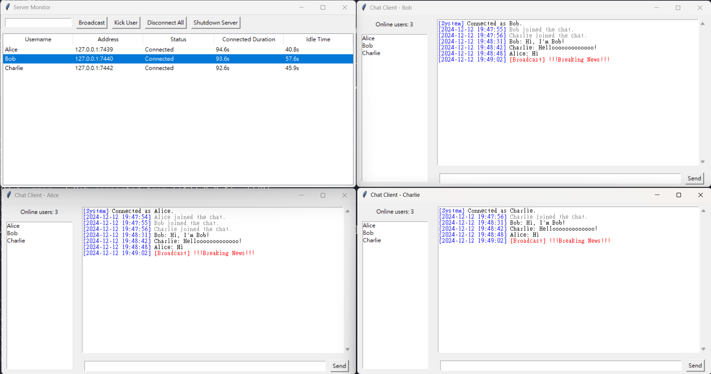

# Socket Programming Chatroom 🕸️



## Features

### Client

- [x] **使用者登入**：提供使用者建立唯一使用者名稱、登入並建立安全連線。
- [x] **即時訊息傳遞**：參與共享聊天室，即時交換訊息。
- [x] **線上成員顯示**：即時顯示線上成員列表。
- [ ] **訊息時間戳**：每則訊息均附有精確的時間戳。
- [x] **自動重新連線**：支援當使用者意外斷線時，自動重新連線功能，無須重啟應用程式。

### Server Monitor

- [x] **連線總覽**：提供所有連線的即時資訊，包括連線狀態與持續時間（連線中、離線、重連中）。
- [x] **手動管理**：管理員可手動中斷特定使用者的連線。
- [x] **閒置超時處理**：自動中斷超過預設閒置時間的使用者連線，節省伺服器資源。
- [x] **廣播訊息**：支援伺服器端廣播訊息，傳遞給所有連線使用者。
- [x] **伺服器全面控制**：提供終止所有連線或關閉伺服器的選項，實現全面掌控。
- [x] **圖形介面**：提供直觀的圖形介面，用於監控與管理伺服器活動。

## Environment

### Setup

```bash
conda create -n sp-chat python=3.12
conda activate sp-chat
pip install -r requirements.txt
```

### Requirements

| Item       | Version/Name                                                           |
| ---------- | ---------------------------------------------------------------------- |
| Python     | 3.12                                                                   |
| GUI        | [Tkinter](https://tkdocs.com/tutorial/index.html)                      |
| Encryption | [cryptography](https://cryptography.io/en/latest/)                     |
| Socket     | [Python Socket](https://docs.python.org/zh-tw/3.12/howto/sockets.html) |

## Usage

### Config

You can modify the configuration in `config.py` or `.env` file. For `.env.example`, you can rename it to `.env` and modify the content.

```plaintext
# Network Configurations
CHAT_SERVER_HOST=0.0.0.0
CHAT_CLIENT_HOST=127.0.0.1
CHAT_TCP_PORT=5000
CHAT_UDP_PORT=5001
CHAT_BUFFER_SIZE=1024
CHAT_IDLE_TIMEOUT=60

# Client Configurations
CHAT_RECONNECT_DELAY=3
CHAT_MAX_RETRIES=3

# AES key and IV (Must match server and client)
CHAT_SECRET_KEY=this_is_a_32_byte_key_demo123456
CHAT_IV=0123456789ABCDEF
```

### Run Server

```bash
./scripts/run_server.sh
```

### Run Client

```bash
./scripts/run_client.sh
```

### Example (Single Server & 3 Clients)

```bash
python scripts/example.py
```

## Grading

### Implementation (90%)

Baseline (80%): Basic TCP or UDP application like sample codes （單一用戶端連線，阻塞模式）

| Item                                       | Description                                                      | Bonus | Checked | Explanation                                                                                                                                                                        |
| ------------------------------------------ | ---------------------------------------------------------------- | ----- | ------- | ---------------------------------------------------------------------------------------------------------------------------------------------------------------------------------- |
| Multi-client connections                   | 支援多用戶端連線。                                               | +10   | ✅      |                                                                                                                                                                                    |
| Multi-process or multi-thread              | 使用多進程或多執行緒提升效能。                                   | +10   | ✅      | Server, GUI, Monitor, Client Connection, Presence Broadcast 等擁有各自的 Thread                                                                                                    |
| GUI                                        | 增加圖形使用者介面。                                             | +10   | ✅      | Server Monitor 以及 Chatroom 皆有 GUI                                                                                                                                              |
| Message split                              | 處理超出 buffer 大小的訊息分割問題。                             | +5    | ✅      | 使用兩個 `recv`，第一個用於確定長度，第二個用於取得訊息的資料部分。                                                                                                                |
| Use both UDP & TCP and Explain why         | 同時使用 TCP 和 UDP，並解釋此設計的必要性及優勢。                | +5    | ✅      | **訊息傳遞**需要確保順序性以及穩定性，故使用 **TCP**。**廣播在線使用者**需要即時性，但就算有部分遺失也沒關係，下次廣播也會再次發送，故**使用 UDP**，節省伺服器資源並提高傳輸銷率。 |
| Message encryption & decryption            | 實現訊息加密與解密，並解釋設計理念與加解密方式。                 | +5    | ✅      | 為求簡單，僅使用 **Symmetric Encryption (AES-CBC + PKCS7 padding)**。實務上先使用 Asymmetric 做 Key Exchange，後續傳輸皆使用 Symmetric 會比較好，安全性與效率兼顧。                |
| Timeout handling                           | 設計機制處理閒置或未正常關閉的連線，避免資源耗盡。               | +5    | ✅      | 追蹤 Client 的 `last_active`，若超過 `IDLE_TIMEOUT` 便會中斷 Client 連線。                                                                                                         |
| Disconnection handling & Auto Reconnection | 如果用戶端斷線，自動重新連接，而非重新啟動用戶端。               | +5    | ✅      | 若 Client 並非因關閉而導致連線中斷，Client 會在 `MAX_RETRIES` 次數內自動嘗試重新連線。                                                                                             |
| Multi-Port Listing                         | 為不同連線需求（如傳訊、廣播、影音串流等）提供不同的連接埠。     | +5    | ✅      | 傳訊使用 TCP (default= 5000)、廣播使用 UDP (default=5001)                                                                                                                          |
| Nonblocking and explain why                | 實現非阻塞模式，並解釋如何避免多用戶或大量訊息時其他功能被阻塞。 | +5    | ✅      | 使用 Multi-threaded 來達到類似 Nonblocking 的效果。使用 `select` 會是比較正確的做法                                                                                                |
| P2P                                        | 挑戰實現基於 P2P 的分散式下載。                                  | +20   |         |                                                                                                                                                                                    |

### Report (10%)

**使用大型語言模型 (LLM) 提升程式碼品質**  
（如可讀性、結構優化、解耦合、可維護性、錯誤處理等），撰寫簡易報告，包含以下議題：

| Report Sections                   | Description                                          | Checked |
| --------------------------------- | ---------------------------------------------------- | ------- |
| Prompt 的設計與使用的大型語言模型 | 說明 Prompt 的設計及所使用的 LLM。                   |         |
| 優化後的程式碼與原始程式碼的比較  | 比較優化後與原始程式碼，針對不同的優化方向進行探討。 |         |
| LLM 的有效性與局限性              | 評估 LLM 的有效性與局限性。                          |         |
| LLM 在作業中其他應用方向          | 探討除了提升程式碼品質外，還可以如何應用 LLM。       |         |
